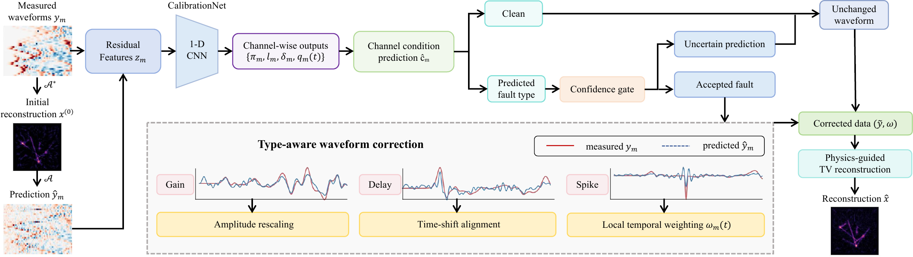

# ContinuousRoute

**Wave-residual guided continuous channel calibration for sparse-view photoacoustic tomography**

ContinuousRoute is a reliability layer for sparse-view photoacoustic tomography (PAT). It uses a nominal wave-model prediction and the measured-predicted residual to identify channel-specific gain errors, temporal delays, and transient interference. The method rescales gain-corrupted waveforms, aligns delayed waveforms, and locally downweights transient support before physics-guided reconstruction.



## Highlights

- Type-aware treatment of mixed gain, delay, and transient channel faults.
- Joint prediction of channel condition, continuous log-gain, continuous delay, and sample-level spike support.
- Physics-guided reconstruction with corrected measurements and temporal reliability weights.
- Evaluation on controlled simulations and frame-disjoint preclinical and in vivo PATATO measurements.

## Main results

PSNR (dB) under four severity-3 mixed faulty channels. `R` and `C` denote random and contiguous faulty-channel layouts.

| Method | Simulation R | Simulation C | Preclinical R | Preclinical C | In vivo R | In vivo C |
|---|---:|---:|---:|---:|---:|---:|
| Equal | 26.553 | 26.415 | 27.405 | 27.613 | 25.584 | 25.603 |
| RuleTemporal | 26.773 | 26.627 | 24.603 | 24.629 | 22.550 | 22.525 |
| Huber | 26.500 | 26.359 | 22.219 | 22.048 | 20.526 | 20.492 |
| HardReject (3-seed mean) | 26.511 | 26.189 | 31.975 | 31.236 | 28.667 | 28.494 |
| **ContinuousRoute (3-seed mean)** | **27.327** | **27.154** | **36.159** | **36.319** | **30.294** | **30.479** |
| OracleFull | 27.475 | 27.334 | 60.861 | 53.730 | 58.585 | 50.606 |

Learned-method entries are averaged over three independently trained models. See [docs/RESULTS.md](docs/RESULTS.md) for per-seed tables and interpretation.

## Repository layout

```text
assets/                    selected method and result figures
configs/                   simulation configurations
docs/                      results and reproduction notes
pat_reliability/            maintained algorithm package
  calibration.py            shared gain/delay/spike correction utilities
  experimental/            measured PATATO operators and routing
scripts/final/              simulation train/evaluate/qualitative entry points
scripts/experimental/       PATATO preparation, training and evaluation
checkpoints/                small final model checkpoints only (Git allowlist)
tests/                      deterministic correction tests
```

The manuscript, historical code, raw data, intermediate results, archives, caches, and LaTeX build products are kept locally but excluded by `.gitignore`.

## Installation

```bash
python3 -m venv .venv
source .venv/bin/activate
python -m pip install -r requirements.txt
```

Python 3.10 or newer is recommended.

## Tests

```bash
python -m unittest discover -s tests -v
```

## Reproducing Table 1 (simulation)

Table 1 reports 100 fixed simulated cases with four severity-3 faulty
channels. Random and contiguous layouts use test seeds 99101 and 99102,
respectively. ContinuousRoute results are reported for independently trained
models with seeds 51, 52, and 53. The final route uses a confidence threshold
of 0.75 and the `no_residual_gate` setting.

Train one model for each seed (replace `51` with `52` and `53`):

```bash
python -m scripts.final.train \
  --config configs/local_128.json --seed 51 \
  --train-cases 2000 --validation-cases 400 \
  --output checkpoints/server_128/continuous/calibration_seed51_large.pt
```

For each trained model, run the following commands. Replace `seed51` in the
checkpoint path with the matching model seed. The `hard` protocol reports the
HardReject row, while `robust` reports the Huber row.

```bash
# Table 1: random layout
python -m scripts.final.evaluate \
  --protocol hard --config configs/local_128.json \
  --checkpoint checkpoints/server_128/continuous/calibration_seed51_large.pt \
  --test-seed 99101 --cases 100 --fault-count 4 --severity 3 \
  --layout random --confidence 0.75 --ablation no_residual_gate --workers 16

python -m scripts.final.evaluate \
  --protocol robust --config configs/local_128.json \
  --checkpoint checkpoints/server_128/continuous/calibration_seed51_large.pt \
  --test-seed 99101 --cases 100 --fault-count 4 --severity 3 \
  --layout random --confidence 0.75 --ablation no_residual_gate --workers 16

# Table 1: contiguous layout
python -m scripts.final.evaluate \
  --protocol hard --config configs/local_128.json \
  --checkpoint checkpoints/server_128/continuous/calibration_seed51_large.pt \
  --test-seed 99102 --cases 100 --fault-count 4 --severity 3 \
  --layout contiguous --confidence 0.75 --ablation no_residual_gate --workers 16

python -m scripts.final.evaluate \
  --protocol robust --config configs/local_128.json \
  --checkpoint checkpoints/server_128/continuous/calibration_seed51_large.pt \
  --test-seed 99102 --cases 100 --fault-count 4 --severity 3 \
  --layout contiguous --confidence 0.75 --ablation no_residual_gate --workers 16
```

Run `python -m scripts.final.evaluate --help` for all evaluation options.

## Measured PATATO workflow

Raw and processed measurement files are intentionally not committed. After obtaining the PATATO HDF5 acquisitions, create the sparse-view package:

```bash
python -m scripts.experimental.prepare_patato \
  --input /path/to/preclinical_phantom.hdf5 \
  --output data/patato/preclinical_phantom_32ch_256t.npz

python -m scripts.experimental.train_patato_calibration \
  --data data/patato/preclinical_phantom_32ch_256t.npz \
  --seed 61 --train-cases 2000 --validation-cases 400 \
  --output checkpoints/experimental/patato/patato_seed61.pt

python -m scripts.experimental.evaluate_patato_calibration \
  --data data/patato/preclinical_phantom_32ch_256t.npz \
  --checkpoint checkpoints/experimental/patato/patato_seed61.pt \
  --split test --cases 130 --fault-count 4 --severity 3 --layout random
```

The reported experiments use frame-disjoint splits; see [docs/REPRODUCIBILITY.md](docs/REPRODUCIBILITY.md) before reproducing measured experiments.

## Important scope note

The measured experiments use real PATATO waveforms with controlled, labelled channel faults injected for evaluation. Their reconstruction reference is the uncorrupted sparse 32-channel reconstruction from the same held-out acquisition; it is not a fully sampled ground-truth image.

## Citation

The ICASSP 2027 manuscript is under submission. Citation metadata will be added after publication.
